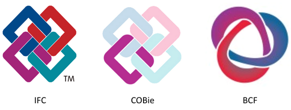

# OpenBIM

### Denne side hjælper dig med at finde de mest relevante materialer vedrørende OpenBIM

Materialerne benyttes i DTUs BIM-kurser: 41927, 41912 

Følgende områder gennemgås:  **IFC**, **MVD**, **BCF**, **BIM7AA**, **CCS**,  **COBie**, 

- [ ] IFC
- [x] MVD
- [ ] BCF
- [ ] BIM7AA
- [ ] CCS
- [ ] COBie


### Eksempler
```
Code goes in here
**unformated**
and examples

equations and snips
x = y/x
```

### Lister
- Lesson 1
- Lesson 2


### Tabeller

First header | Second header
-------------|--------------
Content cell 1|Content cell 2
Content cell 3|Content cell 4



